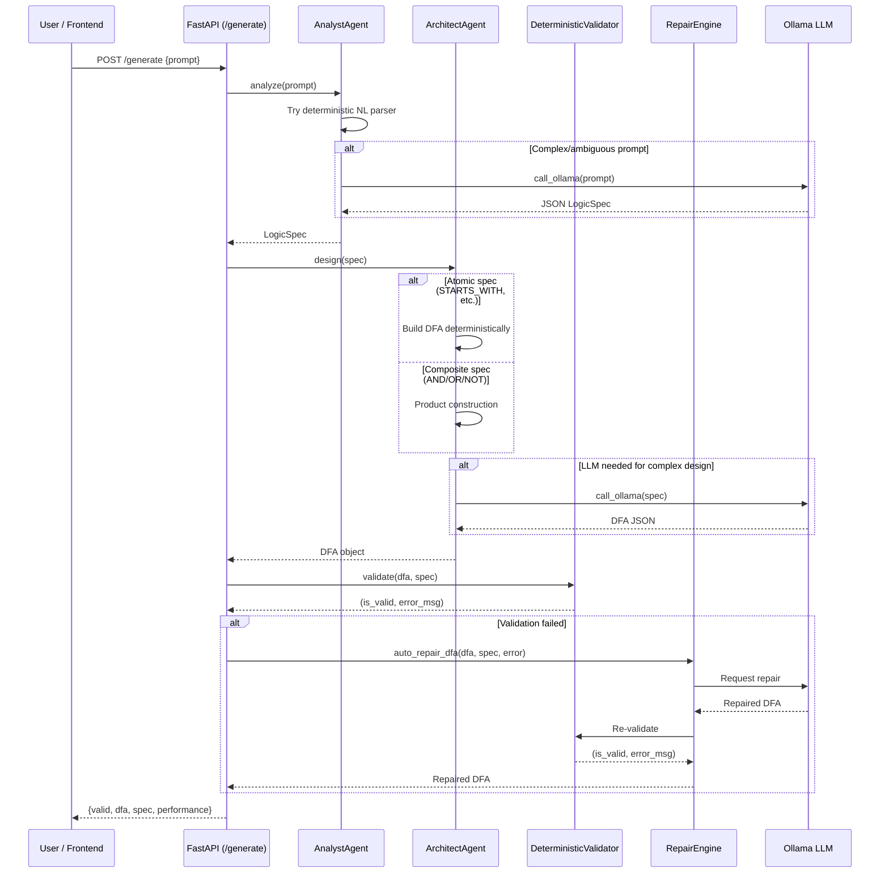

```markdown
# Auto-DFA — README (Updated)

This project generates deterministic finite automata (DFAs) from natural-language descriptions using a modular pipeline:
- AnalystAgent (parse natural language -> LogicSpec)
- ArchitectAgent (construct DFAs for atomic LogicSpecs; compose DFAs for AND/OR/NOT)
- DeterministicValidator (check DFA against ground truth semantics)
- Repair engine and visualizer for diagnostics

This README section documents newly added natural-language forms, parsing rules, configuration, and examples.

## New Natural-Language Patterns Supported

You can now express a broad set of constraints directly in the prompt. The parser recognizes the following atomic forms (examples shown):

Pattern-based (string-pattern recognition)
- Starts with a prefix:
  - "starts with '101'" → STARTS_WITH target "101"
  - "begin with 01"
- Ends with a suffix:
  - "ends with '01'" → ENDS_WITH target "01"
- Contains a substring:
  - "contains '110'" → CONTAINS target "110"
- Does not contain a substring:
  - "does not contain '00'" → NOT_CONTAINS target "00"
- No consecutive symbol:
  - "no consecutive '1'" → NO_CONSECUTIVE target "1"

Mathematical & numerical constraints
- Divisibility:
  - "divisible by 3" → DIVISIBLE_BY target "3" (binary/decimal mapping rules apply, see Alphabet rules)
  - "even number" → shorthand for DIVISIBLE_BY 2
- Product parity:
  - "product is even" → PRODUCT_EVEN (accepts strings whose digit-product parity is even; implemented conservatively)
- Count modulo (number of occurrences modulo k):
  - "count of 1s mod 3 = 2" → COUNT_MOD target "1:2:3" (symbol:r:k)
- Even/Odd counts:
  - "even number of 1s" → EVEN_COUNT target "1"
  - "odd number of a's" → ODD_COUNT target "a"

Length-based constraints
- Exact length:
  - "length is 5" or "strings of length 5" → EXACT_LENGTH target "5"
- Minimum / maximum:
  - "at least 3 characters" → MIN_LENGTH target "3"
  - "at most 7 characters" → MAX_LENGTH target "7"
- Length modulo:
  - "length mod 3 = 1" or "len % 3 == 1" → LENGTH_MOD target "1:3" (r:k)

Compositions (AND / OR / NOT)
- Simple multi-clause composition is supported locally:
  - "starts with '101' and divisible by 3 and contains '11'"
  - "(contains '11' or ends with '01') and not contain '00'"
- The parser attempts a conservative local split on top-level "and" / "or". If an expression is ambiguous or too complex, the system falls back to the LLM-based analyzer.

## Alphabet & Mapping Rules (important for numeric checks)

To interpret numeric properties (DIVISIBLE_BY, even/odd, product parity), the system must map string symbols to digits. The rules are conservative:

- If the alphabet is exactly ['0','1']: treat inputs as binary (base=2).
- If alphabet contains exactly two single-character symbols (e.g., ['a','b']): map alphabet[0] -> 0 and alphabet[1] -> 1 (binary semantics).
- If all alphabet symbols are decimal digits: treat as decimal (base=10).
- Otherwise: DIVISIBLE_BY and numeric checks are not supported and will yield an error (the system avoids making unsafe assumptions).
- Single-letter target assumption: if the user writes a single letter symbol like 'a' and does not specify alphabet, the parser assumes a paired alphabet ['a','b'] (similarly '0' implies ['0','1']) — this behavior aims to reduce ambiguous prompts and can be overridden by explicitly specifying the alphabet in a follow-up prompt.

## Safety / Performance: Product-size Threshold

Composing DFAs (via product construction for AND/OR) multiplies state counts. To avoid combinatorial blow-ups:

- The system uses an estimated product-size upper bound before building large compositions.
- Default safety threshold: AUTO_DFA_MAX_PRODUCT_STATES = 2000 (configurable via environment variable or CLI).
- If the estimated product size exceeds the threshold, architect returns an informative error suggesting you simplify constraints or adjust the threshold.
- You can override behavior by setting the environment variable or passing --max-product-states to the CLI.

## CLI / ENV

- Model (LLM) name (if using Ollama): AUTO_DFA_MODEL (default: qwen2.5-coder:1.5b)
- Max product states threshold: AUTO_DFA_MAX_PRODUCT_STATES (default: 2000)

Example: run the CLI with a custom threshold
```bash
python backend/python_imply/main.py --max-product-states 5000 --prompt "starts with '101' and divisible by 3"
```

## Examples (prompts you can try)
- starts with '101'
- contains '110'
- does not contain '00'
- even number of 1s
- divisible by 3
- length is 5
- length mod 3 = 1
- count of 1s mod 3 = 2
- starts with '101' and divisible by 3 and contains '11'

## Testing & Development

Run the Python unit tests:
```bash
cd backend/python_imply
pytest -q
```

If you rely on Ollama or another LLM, wire the BaseAgent.call_ollama method to your client so the LLM fallback path works.

## Notes / Limitations

- The NL parser is intentionally conservative. For complex nested boolean logic or ambiguous phrasing the system will either:
  - fall back to the LLM-based analyzer (if configured), or
  - ask for clarification.
- Non-regular properties (primality, perfect square, general factorization) are not supported because DFAs cannot decide those languages for arbitrary-length inputs.

## Agent Interaction Sequence

The following diagram shows how a request flows through the multi-agent pipeline:



## Error Handling for Invalid / Ambiguous Prompts

The system handles errors at multiple levels:

| Error Type | HTTP Status | Example | System Response |
|-----------|------------|---------|-----------------|
| Empty/whitespace prompt | 422 | `""`, `"   "` | Pydantic validation rejects before processing |
| Too-long prompt | 422 | 501+ characters | Input sanitizer rejects |
| Unrecognized pattern | 400 | `"do something weird"` | AnalystAgent raises `ValueError` |
| Ambiguous composition | Fallback to LLM | `"maybe starts or ends"` | Parser defers to Ollama for interpretation |
| Unsupported property | 400 | `"is a prime number"` | Error: non-regular property not supported |
| Product state explosion | 400 | 3+ complex AND clauses | Exceeds `MAX_PRODUCT_STATES` threshold |
| Ollama offline | 503 | Service unavailable | Retry 3× with backoff, then structured error |
| DFA validation fails | 200 (valid=false) | Logic error in design | Returns DFA with `valid: false` and error message |

When the deterministic parser cannot interpret a prompt, it falls back to the LLM-based analyzer. If the LLM is also unavailable, the system returns a clear 503 error with a hint to start Ollama.

## Advanced Usage Examples

Beyond basic patterns, the system supports complex compositions:

```text
# Composite AND (product construction)
"starts with 'a' and ends with 'b'"
"contains '01' and even number of 1s"
"starts with '101' and divisible by 3 and contains '11'"

# Composite OR
"contains '11' or ends with '01'"
"starts with 'a' or starts with 'b'"

# Composite NOT
"does not contain '00'"
"not starts with 'b'"

# Multi-constraint (advanced)
"strings with even number of a's and odd number of b's"
"length mod 3 = 1 and starts with '0'"
"count of 1s mod 3 = 2 and ends with '01'"

# Numerical on custom alphabets
"divisible by 5"                    # binary interpretation over {0,1}
"even number"                       # shorthand for divisible by 2
"product is even"                   # digit product parity
```

## Model Configuration

The LLM model used for complex prompt analysis and DFA repair is configurable:

| Variable | Default | Description |
|----------|---------|-------------|
| `AUTO_DFA_MODEL` | `qwen2.5-coder:1.5b` | Ollama model name |

To use a different model (e.g., Llama 3):
```bash
export AUTO_DFA_MODEL=llama3:8b
ollama pull llama3:8b
python api.py
```

> **Note:** Different models may produce different accuracy levels. Always run the QA pipeline (`python scripts/batch_verify.py`) after switching models to validate quality.

## Contributing

Please see [CONTRIBUTING.md](CONTRIBUTING.md) for code style, PR process, and testing requirements.
